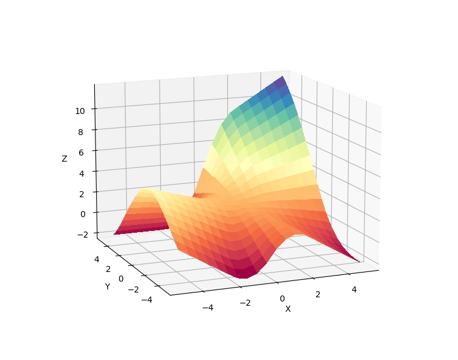
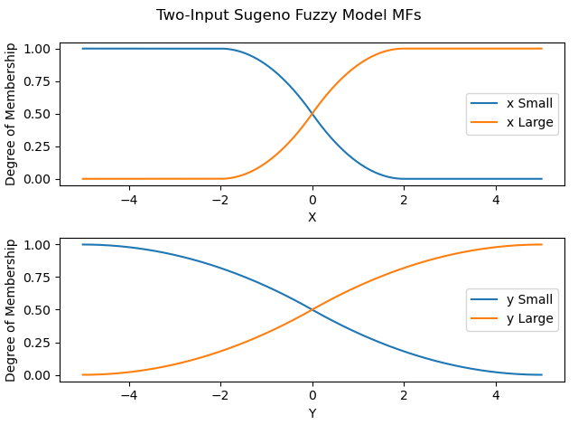

# Fuzzy

This repository is an experiment in creating [fuzzy-logic](https://en.wikipedia.org/wiki/Fuzzy_logic) systems from
first-principles. In particular, the driver code in `main.py` computes the input-output surface for a 2 input Sugeno Fuzzy inference
system.

The rules of the system are given by:

1. if x is small and y is small, then `z = -x + y + 1`
2. if x is small and y is large, then `z = -y + 3`
3. if x is large and y is small, then `z = -x + 3`
4. if x is large and y is large, then `z = x + y + 2`

The membership functions of the antecedents are given by the following Z and S curves:

